# 🚀 Propos4l - Automação Inteligente de Propostas

## 💼 Transformando o Processo Comercial com IA de Ponta

O **Propos4l** revoluciona a maneira como consultorias de TI criam e gerenciam propostas comerciais, reduzindo de **dias para minutos** o tempo necessário para elaborar documentos profissionais e personalizados. Nossa plataforma combina o poder de **Large Language Models (LLMs)**, **Processamento de Linguagem Natural (NLP)** e **Busca Vetorial de Alta Precisão** para transformar sua base de conhecimento em uma poderosa ferramenta de geração de propostas.

### 🔥 Diferenciais de Negócio

- **Aumento de 300% na Produtividade da Equipe Comercial**: Automatize tarefas repetitivas e foque no que realmente importa - relacionamento com clientes e fechamento de negócios
- **Consistência e Qualidade Garantidas**: Templates inteligentes extraídos de suas melhores propostas garantem consistência na comunicação da marca
- **Redução de 70% no Ciclo de Vendas**: Responda a RFPs e oportunidades com rapidez inigualável, superando a concorrência
- **Análise Preditiva de Sucesso**: Algoritmos avançados identificam padrões em propostas vencedoras para maximizar taxas de conversão
- **Escalabilidade Imediata**: Capacite novos vendedores com o conhecimento institucional da empresa desde o primeiro dia

Bem-vindo ao Propos4l, uma solução inovadora para automação e geração de propostas comerciais e técnicas para consultoria de TI. Este sistema utiliza Inteligência Artificial para transformar o processo manual de criação de propostas em um fluxo eficiente e inteligente.

## 📋 Visão Geral

O Propos4l resolve o desafio comum em empresas de consultoria de TI: a criação manual e repetitiva de propostas comerciais. Utilizando tecnologias modernas como LLMs (Large Language Models) e processamento de linguagem natural, o sistema aprende com propostas anteriores para gerar novos documentos personalizados e profissionais.

### 🔄 Fluxo de Trabalho

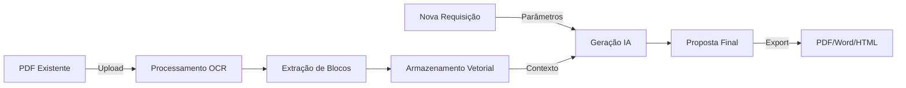

### 🔍 Processamento Inteligente de Documentos

O Propos4l utiliza um pipeline sofisticado de processamento de documentos que combina várias tecnologias de ponta:

#### 1. Extração de Texto
- Processamento direto de PDFs usando PyMuPDF
- OCR (Reconhecimento Óptico de Caracteres) para páginas digitalizadas
- Preservação de metadados de formatação (fontes, estilos, layouts)

#### 2. Análise Inteligente
- **Entidades**: Identificação de pessoas, empresas, locais e datas
- **Termos Técnicos**: Reconhecimento de termos específicos da área de TI
- **Palavras-Chave**: Extração das frases mais relevantes do documento
- **Complexidade**: Análise da estrutura e complexidade do texto

#### 3. Identificação de Seções
- Detecção automática de seções comuns em propostas:
  - Título e informações do projeto
  - Contexto e situação atual
  - Problema e necessidades do cliente
  - Solução proposta
  - Escopo e entregas
  - Cronograma
  - Investimento e custos
  - Diferenciais competitivos

#### 4. Otimizações de Performance
- Processamento em lotes para maior eficiência
- Cache inteligente para operações frequentes
- Processamento paralelo de tarefas
- Vetorização para busca semântica rápida

#### 5. Monitoramento em Tempo Real
- Interface visual com progresso detalhado
- Barra de progresso animada
- Tempo estimado de conclusão
- Status de cada etapa do processamento
- Indicadores de sucesso/erro
- Métricas de performance

## 🏗️ Arquitetura do Sistema

### Visão Geral da Arquitetura

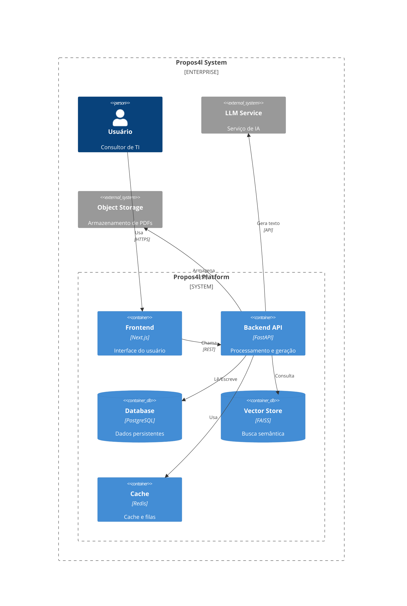

### Componentes do Frontend

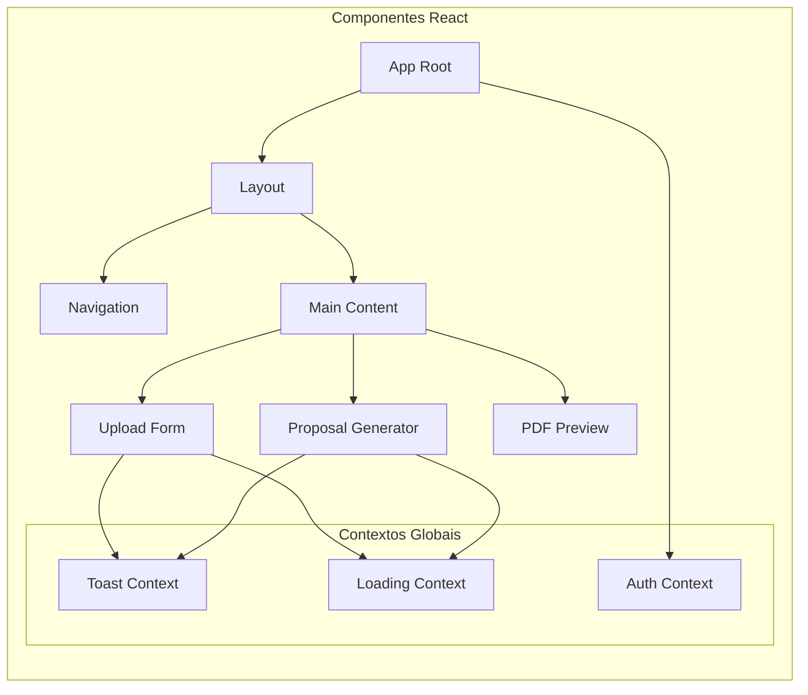

### Modelo de Dados

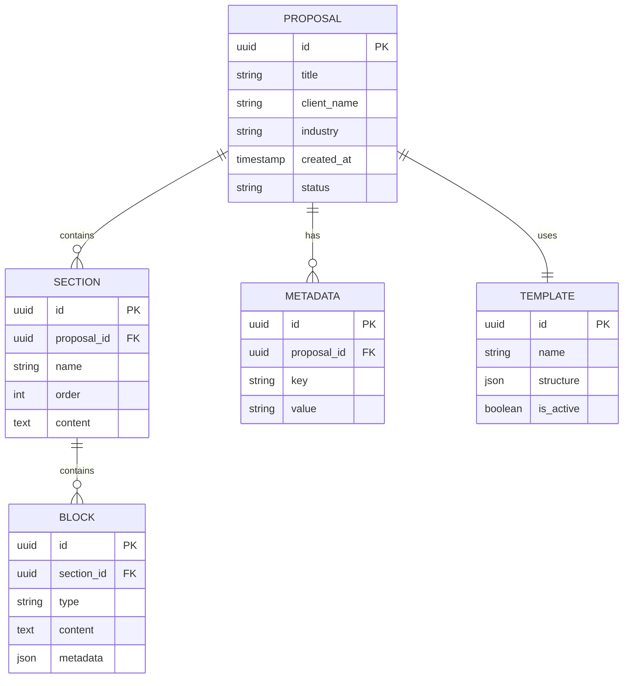

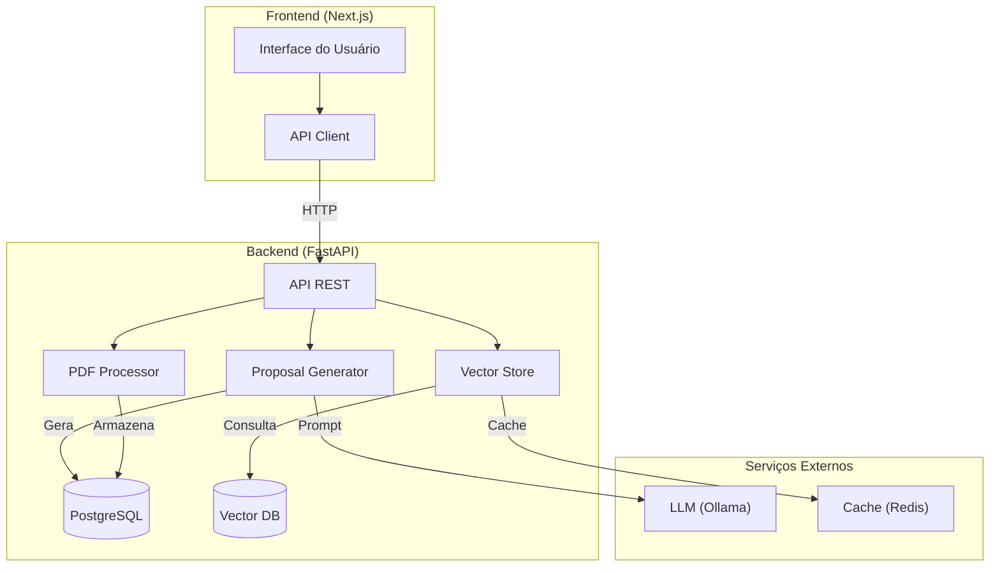

## 💡 Funcionalidades Principais

### Arquitetura de Processamento

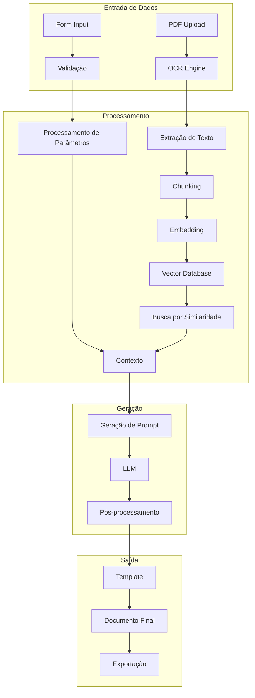

### 1. Processamento Inteligente de PDFs

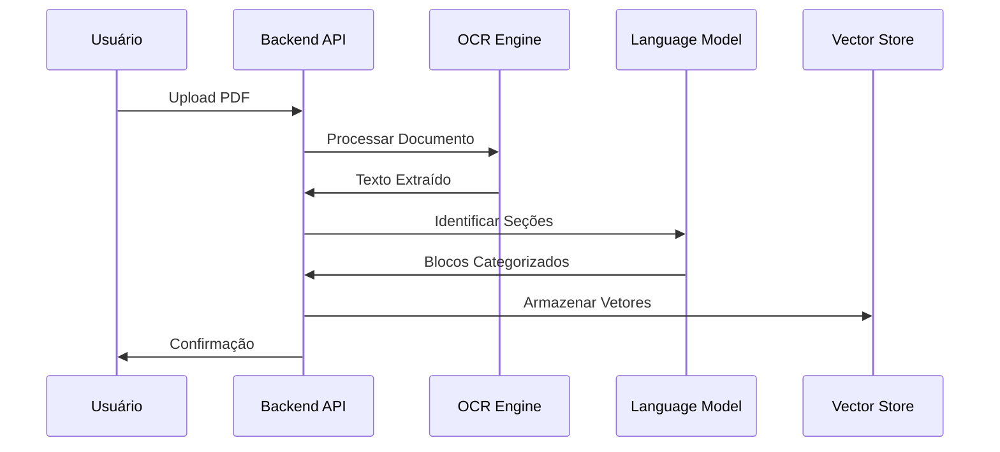

- 📄 OCR para documentos digitalizados
- 🔍 Identificação automática de seções
- 📊 Categorização inteligente de conteúdo
- 🔤 Processamento de múltiplos formatos

### 2. Geração de Propostas

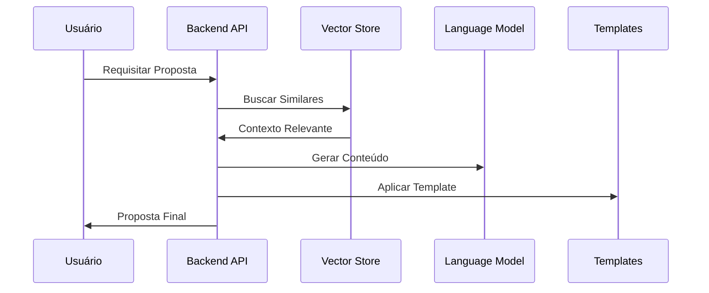

- 🎯 Personalização por cliente/indústria
- 📝 Sugestões inteligentes
- 🔄 Múltiplos formatos de exportação
- 📊 Templates personalizáveis

## 🛠️ Stack Tecnológico

### Frontend
- **Next.js 14**: Framework React moderno
- **Tailwind CSS**: Estilização moderna
- **React Context**: Gerenciamento de estado

### Backend
- **FastAPI**: API REST assíncrona
- **LangChain**: Orquestração de LLMs
- **FAISS**: Busca vetorial eficiente
- **PostgreSQL**: Armazenamento persistente
- **Redis**: Cache e filas

## 🚀 Começando

### Pré-requisitos
- Docker e Docker Compose
- Chave de API para LLM (opcional)

### Instalação com Docker

1. Clone o repositório:
```bash
git clone https://github.com/seu-usuario/propos4l.git
cd propos4l
```

2. Configure as variáveis de ambiente:
```bash
cp .env.example .env
# Edite .env com suas configurações
```

3. Inicie os serviços:
```bash
docker compose up -d
```

### Endpoints da API

#### `GET /api/health`
- Status da API e métricas

#### `POST /api/proposals/upload`
- Upload e processamento de PDFs
```typescript
interface UploadRequest {
  file: File
  metadata: {
    clientName: string
    industry: string
    date: string
  }
}
```

#### `POST /api/proposals/generate`
- Geração de novas propostas
```typescript
interface GenerateRequest {
  clientName: string
  industry: string
  requirements: string
  scope?: string
  timeline?: string
  budget?: string
}
```

#### `POST /api/templates/`
- Geração de templates a partir de PDFs de propostas
```typescript
interface TemplateCreateRequest {
  file: File
  name: string
  description?: string
}
```

#### `GET /api/templates/`
- Listagem de templates disponíveis

#### `GET /api/templates/{template_id}`
- Detalhes de um template específico

## 📈 Fluxo de Desenvolvimento

### Ciclo de Desenvolvimento

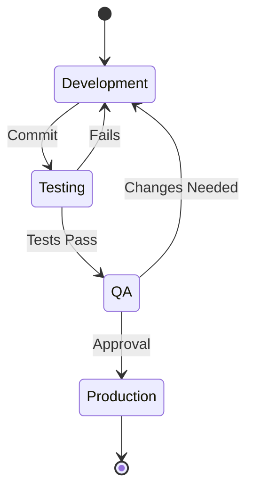

### Pipeline de CI/CD

```mermaid
flowchart LR
    subgraph Local["Desenvolvimento Local"]
        Dev["Desenvolvimento"]
        Test["Testes Locais"]
        Dev --> Test
    end
    
    subgraph CI["Integração Contínua"]
        Push["Git Push"]
        Lint["Linting"]
        Build["Build"]
        UnitTest["Testes Unitários"]
        IntegTest["Testes de Integração"]
        
        Push --> Lint
        Lint --> Build
        Build --> UnitTest
        UnitTest --> IntegTest
    end
    
    subgraph CD["Entrega Contínua"]
        Stage["Staging"]
        E2E["Testes E2E"]
        Prod["Produção"]
        Monitor["Monitoramento"]
        
        IntegTest --> Stage
        Stage --> E2E
        E2E --> Prod
        Prod --> Monitor
    end
    
    Test --> Push
```

### Fluxo de Dados em Tempo Real

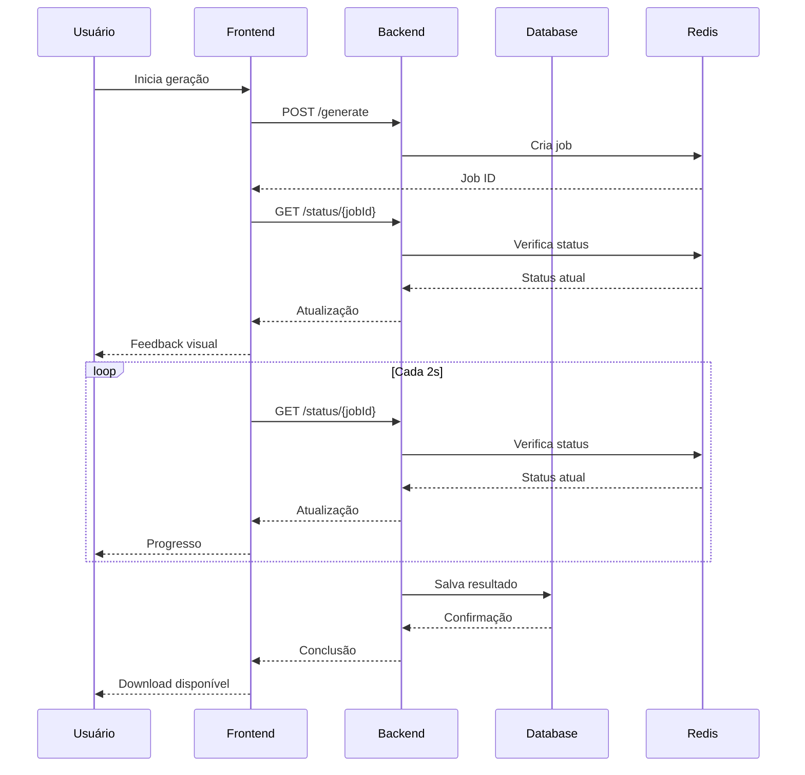


## 🚀 Iniciando o Projeto

### Pré-requisitos

- Docker e Docker Compose
- Git
- Node.js 18+ (para desenvolvimento frontend)
- Python 3.11+ (para desenvolvimento backend)

### Iniciando com Docker

1. Clone o repositório:
```bash
git clone https://github.com/seu-usuario/propos4l.git
cd propos4l
```

2. Configure as variáveis de ambiente:
```bash
cp .env.example .env
# Edite .env com suas configurações
```

3. Inicie os serviços:
```bash
docker compose up -d
```

4. Verifique o status dos serviços:
```bash
docker compose ps
```

5. Acesse a aplicação:
- Frontend: http://localhost:3000
- API: http://localhost:8000
- Swagger UI: http://localhost:8000/docs

### Iniciando em Modo de Desenvolvimento

#### Frontend
```bash
cd frontend
npm install
npm run dev
```

#### Backend
```bash
cd backend
pip install -r requirements.txt
uvicorn app.main:app --reload
```

### Iniciando Migrations

```bash
docker compose run migrations alembic upgrade head
```

### Parando os Serviços

```bash
docker compose down
```

## 🤝 Contribuindo

1. Fork o projeto
2. Crie sua feature branch (`git checkout -b feature/AmazingFeature`)
3. Commit suas mudanças (`git commit -m 'Add: Amazing Feature'`)
4. Push para a branch (`git push origin feature/AmazingFeature`)
5. Abra um Pull Request

## 📝 Licença

Distribuído sob a licença MIT. Veja `LICENSE` para mais informações.
