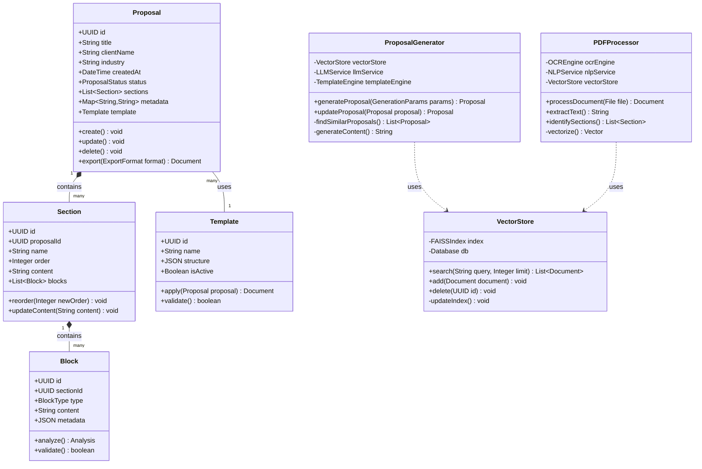
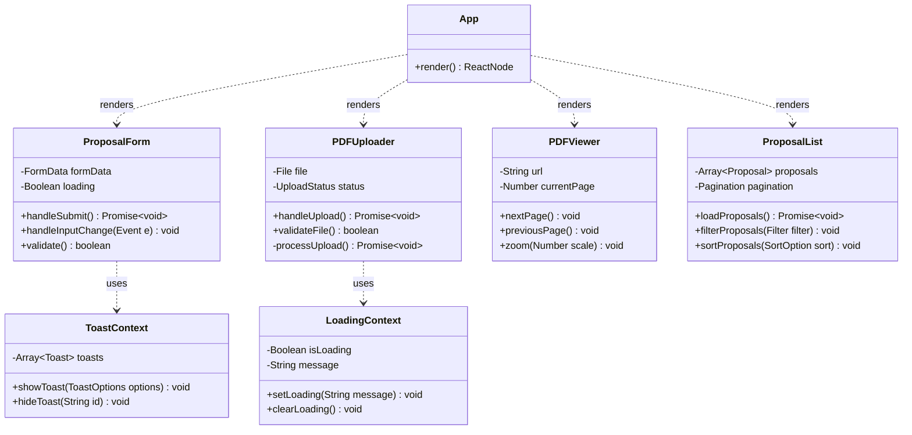

# Diagramas de Classes do Propos4l

## Modelo de Classes Principal



## Diagrama de Classes do Frontend



## Diagrama de Classes de Serviços

```mermaid
classDiagram
    class APIService {
        -String baseUrl
        -Headers headers
        +get(endpoint: String)
        +post(endpoint: String, data: Any)
        +put(endpoint: String, data: Any)
        +delete(endpoint: String)
    }

    class ProposalService {
        -APIService api
        +createProposal(data: ProposalData)
        +updateProposal(id: UUID, data: ProposalData)
        +deleteProposal(id: UUID)
        +listProposals(filters: Filters)
    }

    class DocumentService {
        -APIService api
        -StorageService storage
        +uploadDocument(file: File)
        +processDocument(id: UUID)
        +downloadDocument(id: UUID)
    }

    class AuthService {
        -APIService api
        -TokenStorage storage
        +login(credentials: Credentials)
        +logout()
        +refreshToken()
        +isAuthenticated()
    }

    class StorageService {
        -S3Client client
        +uploadFile(file: File)
        +downloadFile(key: String)
        +deleteFile(key: String)
    }

    class CacheService {
        -RedisClient client
        +get(key: String)
        +set(key: String, value: Any)
        +delete(key: String)
        +expire(key: String, seconds: Number)
    }

    ProposalService -- APIService
    DocumentService -- APIService
    DocumentService -- StorageService
    AuthService -- APIService
