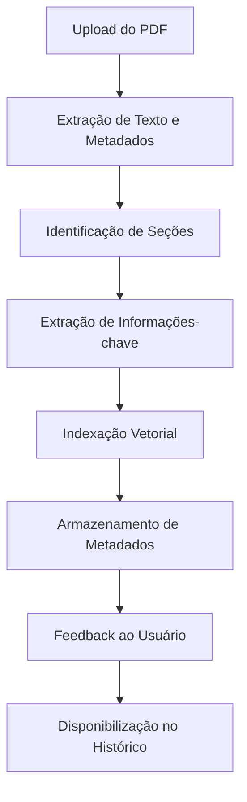
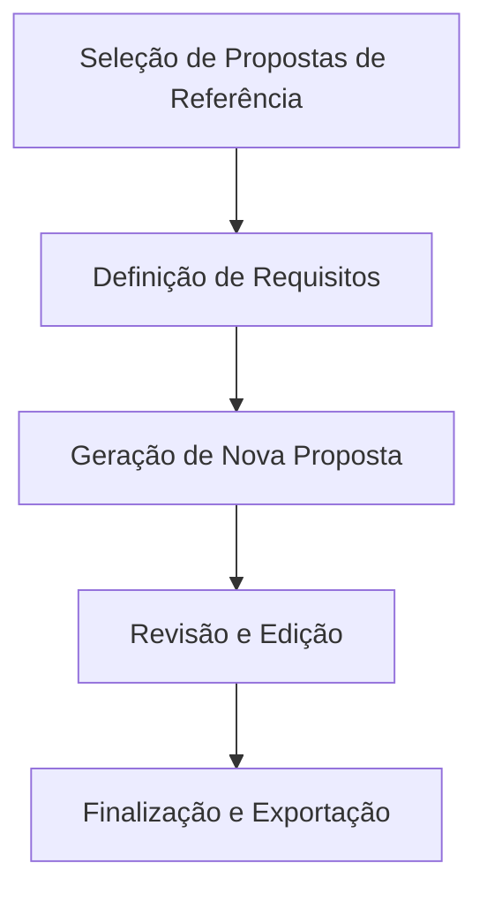
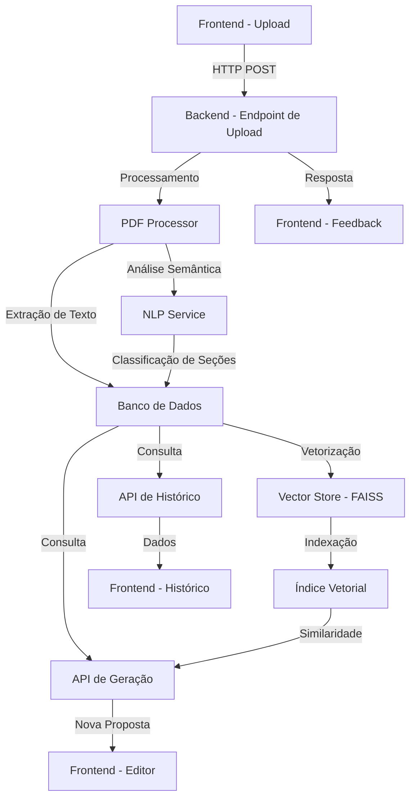
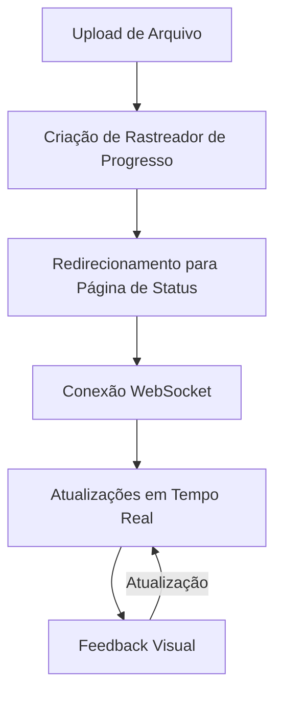

# Como Funciona o Processamento de PDFs no Propos4l

Este documento explica o fluxo completo de processamento de PDFs no sistema Propos4l, desde o upload até o uso posterior para geração de novas propostas.

## Fluxo de Processamento de PDFs

### 1. Upload do PDF

- **Upload Individual**: O usuário pode fazer upload de um único arquivo PDF através da interface.
- **Upload em Massa**: O sistema suporta upload de múltiplos arquivos PDF simultaneamente, processando-os como um conjunto de dados.
- **Formatos Suportados**: Apenas arquivos PDF são aceitos pelo sistema.

### 2. Extração de Texto e Metadados

- O sistema lê o conteúdo binário do PDF
- Utiliza o `PDFProcessor` para extrair o texto completo do documento
- Aplica técnicas de OCR (Reconhecimento Óptico de Caracteres) para PDFs escaneados ou com imagens
- Cria um objeto `Document` no banco de dados com o conteúdo extraído
- Preserva informações sobre formatação, quando possível

### 3. Identificação de Seções

- O sistema analisa o texto extraído para identificar seções semânticas:
  - Introdução
  - Escopo do projeto
  - Metodologia
  - Cronograma
  - Orçamento
  - Termos e condições
  - Equipe e qualificações
- Utiliza modelos de NLP (Processamento de Linguagem Natural) para classificar cada bloco de texto
- Cria objetos `SemanticBlock` no banco de dados para cada seção identificada
- Atribui pontuações de confiança para cada classificação (0.0 a 1.0)
- Seções com pontuação de confiança abaixo de 0.7 são marcadas como incertas

### 4. Extração de Informações-chave

- Extrai dados importantes como:
  - Resumo executivo
  - Palavras-chave
  - Entidades nomeadas (pessoas, organizações, locais)
  - Valores monetários e prazos
  - Tecnologias e ferramentas mencionadas
- Utiliza técnicas avançadas de NLP como:
  - Named Entity Recognition (NER)
  - Keyword Extraction
  - Summarization
- Estas informações são armazenadas para facilitar buscas e análises posteriores

### 5. Indexação Vetorial

- O texto completo é convertido em embeddings vetoriais usando modelos de linguagem
- Os vetores são armazenados no `VectorStore` (implementado com FAISS)
- Cada documento recebe uma representação vetorial que captura seu significado semântico
- Isso permite:
  - Pesquisas semânticas (encontrar documentos similares)
  - Comparações de similaridade entre documentos
  - Recomendações baseadas em conteúdo

### 6. Armazenamento de Metadados

- Gera um ID único para a proposta baseado no nome do cliente e timestamp
- Salva os metadados em um arquivo JSON, incluindo:
  - Nome do cliente
  - Indústria/setor
  - Data de upload
  - Status do documento
- Organiza as seções identificadas com seus conteúdos e pontuações de confiança
- Armazena referências para documentos relacionados ou similares

### 7. Feedback ao Usuário

- No caso de upload individual:
  - Confirma o processamento bem-sucedido
  - Exibe resumo das seções identificadas
- No caso de upload em massa:
  - Registra sucessos e falhas para cada arquivo
  - Retorna contagens de arquivos processados com sucesso e com erro
  - Fornece IDs das propostas criadas para referência futura
- Exibe alertas para seções não identificadas ou com baixa confiança

### 8. Disponibilização no Histórico

- Os documentos processados ficam disponíveis para consulta na página de histórico
- Usuários podem visualizar, filtrar e buscar propostas anteriores
- Cada proposta mostra um resumo das informações extraídas
- Opção para visualizar o documento original ou baixá-lo

## Uso Posterior dos PDFs Processados

### Geração de Novas Propostas

1. **Seleção de Propostas de Referência**:
   - O usuário pode selecionar propostas existentes como referência
   - O sistema pode recomendar propostas similares com base no setor ou cliente

2. **Definição de Requisitos**:
   - O usuário especifica os requisitos para a nova proposta
   - Inclui nome do cliente, indústria, escopo, orçamento, etc.

3. **Geração de Nova Proposta**:
   - O sistema utiliza as propostas de referência e os requisitos para gerar um novo documento
   - Combina seções relevantes das propostas existentes
   - Adapta o conteúdo para os novos requisitos
   - Mantém consistência de estilo e formatação

4. **Revisão e Edição**:
   - O usuário pode revisar a proposta gerada
   - Interface permite edição de seções específicas
   - Sistema sugere melhorias ou correções

5. **Finalização e Exportação**:
   - A proposta final é convertida para PDF
   - Opções para personalização de cabeçalhos, rodapés e estilos
   - Documento é salvo no sistema e disponibilizado para download

### Análise e Insights

O sistema também oferece funcionalidades analíticas:

- **Comparação de Propostas**: Visualizar diferenças entre propostas similares
- **Análise de Tendências**: Identificar padrões em propostas bem-sucedidas
- **Estatísticas de Seções**: Visualizar estatísticas sobre orçamentos, cronogramas, etc.
- **Recomendações de Melhoria**: Sugestões para melhorar seções específicas com base em dados históricos

## Fluxo de Dados Técnico

Este diagrama técnico mostra como os dados fluem entre os diferentes componentes do sistema, desde o upload inicial até o uso para geração de novas propostas.

## Considerações de Desempenho e Escalabilidade

- **Processamento Assíncrono**: Para uploads em massa, o processamento é realizado de forma assíncrona para não bloquear a interface do usuário
- **Caching**: Resultados intermediários são armazenados em cache para melhorar o desempenho
- **Otimização de Vetores**: Técnicas de otimização são aplicadas para melhorar a eficiência da busca vetorial
- **Processamento em Lote**: Operações de banco de dados são realizadas em lote para reduzir o número de transações

## Visualização de Progresso em Tempo Real

O sistema oferece uma interface visual para acompanhar o progresso do processamento de PDFs em tempo real:

### Componentes da Visualização de Progresso

1. **Rastreador de Progresso**:
   - Cada arquivo enviado recebe um ID de rastreamento único
   - O backend mantém o estado de processamento de cada arquivo
   - Registra o início, progresso e conclusão de cada etapa

2. **Interface de Usuário**:
   - Barra de progresso geral mostrando percentual completo
   - Lista de etapas com status visual (aguardando, processando, sucesso, erro)
   - Detalhes sobre cada etapa e tempo de processamento
   - Indicadores visuais de conclusão ou erro

3. **Comunicação em Tempo Real**:
   - Conexão WebSocket para atualizações instantâneas
   - Fallback para API REST em caso de problemas de conexão
   - Reconexão automática em caso de perda de conexão

### Benefícios da Visualização de Progresso

- **Transparência**: O usuário sabe exatamente o que está acontecendo com seus arquivos
- **Feedback Imediato**: Problemas são identificados rapidamente durante o processamento
- **Experiência Melhorada**: Elimina a incerteza durante operações demoradas
- **Diagnóstico**: Facilita a identificação de gargalos ou falhas no processamento

## Limitações Atuais

- O sistema pode ter dificuldades com PDFs muito complexos ou com formatação não convencional
- A extração de tabelas e gráficos ainda é limitada
- Documentos em idiomas diferentes do português e inglês podem ter precisão reduzida
- Arquivos muito grandes (>50MB) podem ter tempos de processamento prolongados

## Próximos Passos e Melhorias Planejadas

- Suporte aprimorado para extração de tabelas e dados estruturados
- Integração com sistemas de gestão de documentos externos
- Melhorias no algoritmo de identificação de seções
- Expansão do suporte a idiomas
- Interface de usuário para treinamento e correção manual de classificações incorretas
