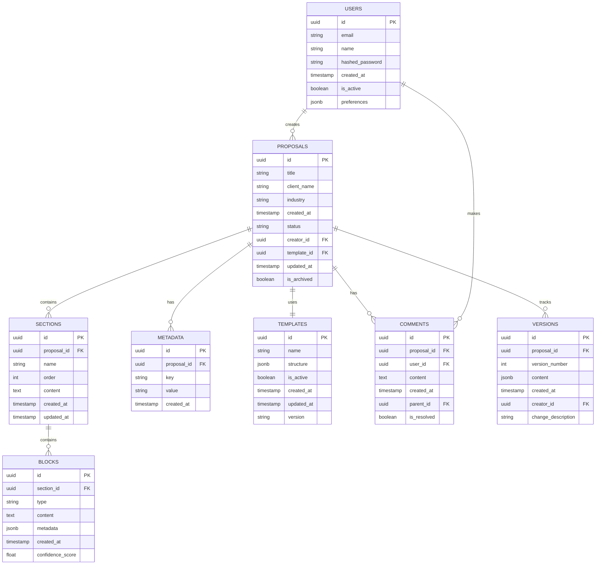
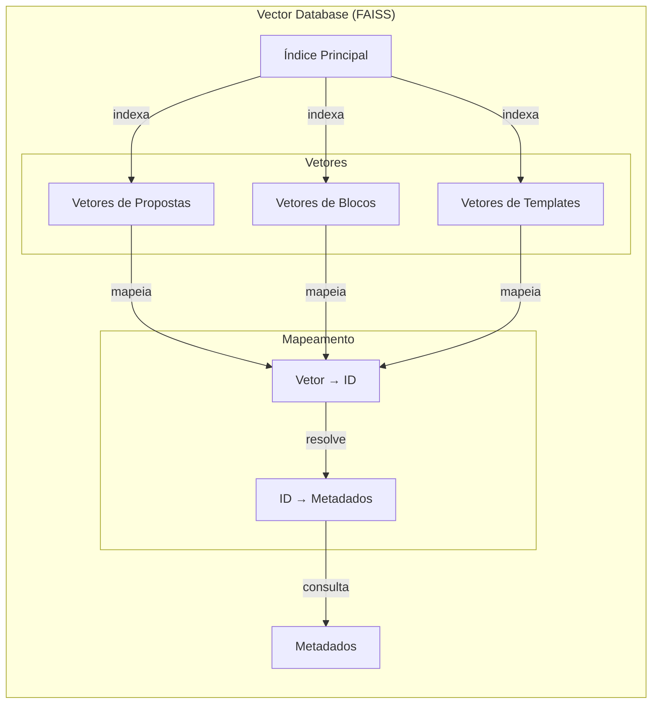
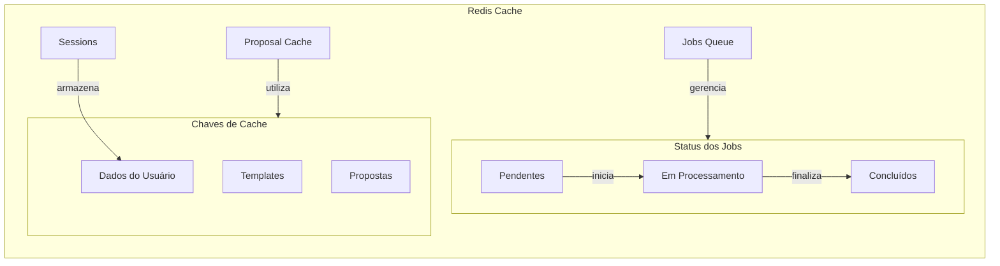

# Modelo de Banco de Dados do Propos4l

## Modelo Entidade-Relacionamento



## Índices e Constraints

```sql
-- Proposals
CREATE INDEX idx_proposals_client_name ON proposals(client_name);
CREATE INDEX idx_proposals_industry ON proposals(industry);
CREATE INDEX idx_proposals_status ON proposals(status);
CREATE INDEX idx_proposals_created_at ON proposals(created_at);

-- Sections
CREATE INDEX idx_sections_proposal_id ON sections(proposal_id);
CREATE INDEX idx_sections_order ON sections(proposal_id, "order");

-- Blocks
CREATE INDEX idx_blocks_section_id ON blocks(section_id);
CREATE INDEX idx_blocks_type ON blocks(type);
CREATE INDEX idx_blocks_confidence ON blocks(confidence_score);

-- Templates
CREATE INDEX idx_templates_active ON templates(is_active);
CREATE INDEX idx_templates_name ON templates(name);

-- Comments
CREATE INDEX idx_comments_proposal_id ON comments(proposal_id);
CREATE INDEX idx_comments_user_id ON comments(user_id);
CREATE INDEX idx_comments_created_at ON comments(created_at);

-- Versions
CREATE INDEX idx_versions_proposal_id ON versions(proposal_id);
CREATE INDEX idx_versions_number ON versions(proposal_id, version_number);
```

## Modelo de Vetores FAISS



## Cache Redis


