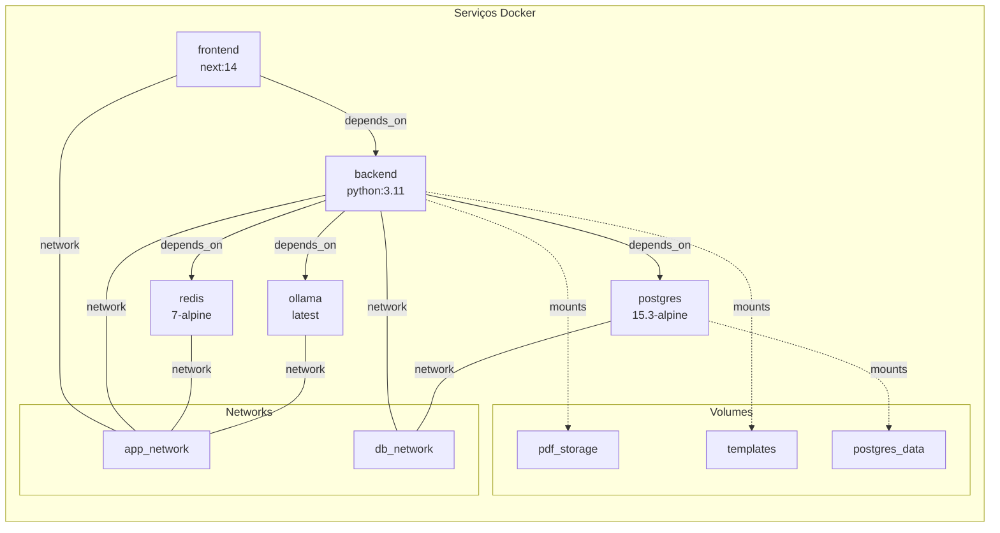
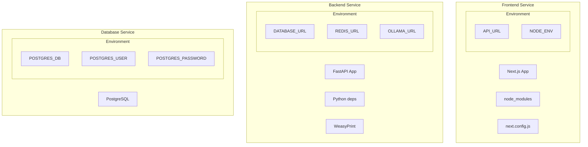
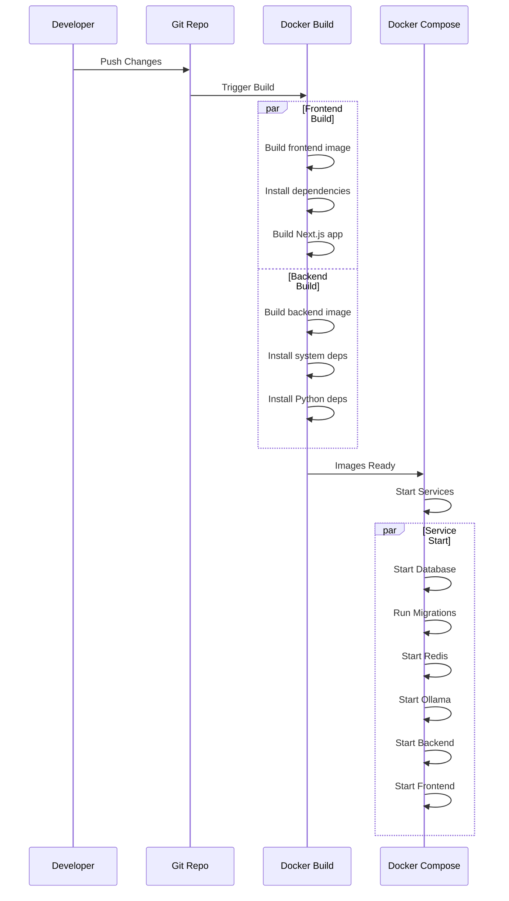
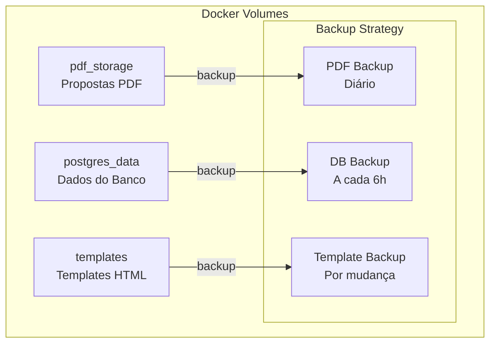
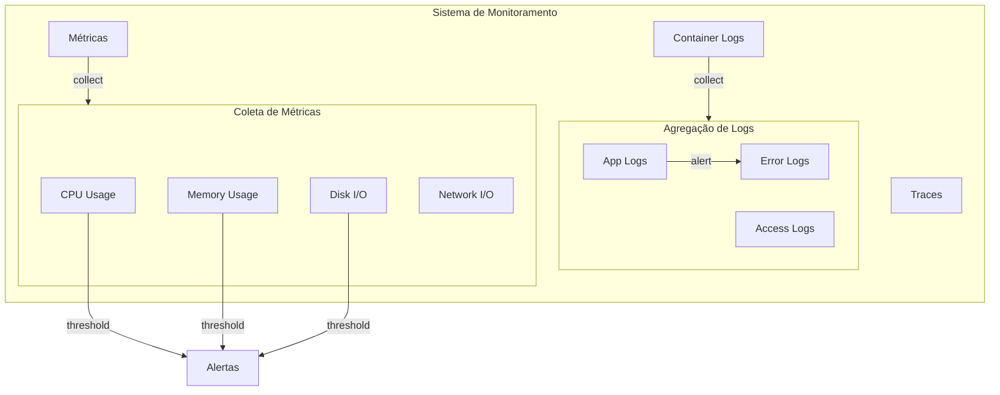

# Arquitetura Docker do Propos4l

## Dependências dos Serviços Docker

```mermaid
graph TB
    subgraph Services["Serviços Docker"]
        direction TB
        Frontend["frontend<br/>next:14"]
        Backend["backend<br/>python:3.11"]
        DB["postgres<br/>15.3-alpine"]
        Redis["redis<br/>7-alpine"]
        Ollama["ollama<br/>latest"]
        
        subgraph Volumes["Volumes"]
            PDFStorage["pdf_storage"]
            DBData["postgres_data"]
            Templates["templates"]
        end
        
        subgraph Networks["Networks"]
            AppNet["app_network"]
            DBNet["db_network"]
        end
    end
    
    Frontend -->|depends_on| Backend
    Backend -->|depends_on| DB
    Backend -->|depends_on| Redis
    Backend -->|depends_on| Ollama
    
    Backend -.->|mounts| PDFStorage
    Backend -.->|mounts| Templates
    DB -.->|mounts| DBData
    
    Frontend ---|network| AppNet
    Backend ---|network| AppNet
    Backend ---|network| DBNet
    DB ---|network| DBNet
    Redis ---|network| AppNet
    Ollama ---|network| AppNet
```

## Configuração dos Serviços

```mermaid
graph TB
    subgraph Frontend["Frontend Service"]
        NextJS["Next.js App"]
        NodeModules["node_modules"]
        NextConfig["next.config.js"]
        
        subgraph FrontendEnv["Environment"]
            NEXT_PUBLIC_API_URL["API_URL"]
            NODE_ENV["NODE_ENV"]
        end
    end
    
    subgraph Backend["Backend Service"]
        FastAPI["FastAPI App"]
        PythonDeps["Python deps"]
        WeasyPrint["WeasyPrint"]
        
        subgraph BackendEnv["Environment"]
            DATABASE_URL["DATABASE_URL"]
            REDIS_URL["REDIS_URL"]
            OLLAMA_URL["OLLAMA_URL"]
        end
    end
    
    subgraph Database["Database Service"]
        Postgres["PostgreSQL"]
        
        subgraph DBEnv["Environment"]
            POSTGRES_DB["POSTGRES_DB"]
            POSTGRES_USER["POSTGRES_USER"]
            POSTGRES_PASSWORD["POSTGRES_PASSWORD"]
        end
    end
```

## Fluxo de Build e Deploy

```mermaid
sequenceDiagram
    participant Dev as Developer
    participant Git as Git Repo
    participant Docker as Docker Build
    participant Compose as Docker Compose
    
    Dev->>Git: Push Changes
    Git->>Docker: Trigger Build
    
    par Frontend Build
        Docker->>Docker: Build frontend image
        Docker->>Docker: Install dependencies
        Docker->>Docker: Build Next.js app
    and Backend Build
        Docker->>Docker: Build backend image
        Docker->>Docker: Install system deps
        Docker->>Docker: Install Python deps
    end
    
    Docker->>Compose: Images Ready
    Compose->>Compose: Start Services
    
    par Service Start
        Compose->>Compose: Start Database
        Compose->>Compose: Run Migrations
        Compose->>Compose: Start Redis
        Compose->>Compose: Start Ollama
        Compose->>Compose: Start Backend
        Compose->>Compose: Start Frontend
    end
```

## Volumes e Persistência

```mermaid
graph TB
    subgraph DockerVolumes["Docker Volumes"]
        PDFStorage["pdf_storage<br/>Propostas PDF"]
        DBData["postgres_data<br/>Dados do Banco"]
        Templates["templates<br/>Templates HTML"]
        
        subgraph Backup["Backup Strategy"]
            PDFBackup["PDF Backup<br/>Diário"]
            DBBackup["DB Backup<br/>A cada 6h"]
            TemplateBackup["Template Backup<br/>Por mudança"]
        end
    end
    
    PDFStorage -->|backup| PDFBackup
    DBData -->|backup| DBBackup
    Templates -->|backup| TemplateBackup
```

## Monitoramento e Logs

```mermaid
graph TB
    subgraph Monitoring["Sistema de Monitoramento"]
        Logs["Container Logs"]
        Metrics["Métricas"]
        Traces["Traces"]
        
        subgraph LogAggregation["Agregação de Logs"]
            AppLogs["App Logs"]
            AccessLogs["Access Logs"]
            ErrorLogs["Error Logs"]
        end
        
        subgraph MetricsCollection["Coleta de Métricas"]
            CPU["CPU Usage"]
            Memory["Memory Usage"]
            Disk["Disk I/O"]
            Network["Network I/O"]
        end
    end
    
    Logs -->|collect| LogAggregation
    Metrics -->|collect| MetricsCollection
    
    AppLogs -->|alert| ErrorLogs
    CPU -->|threshold| Alerts["Alertas"]
    Memory -->|threshold| Alerts
    Disk -->|threshold| Alerts
```
