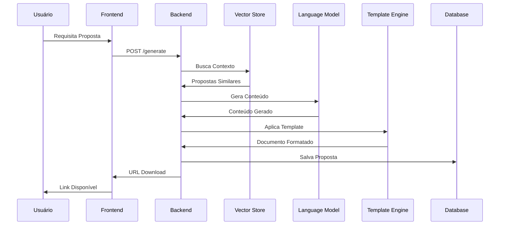
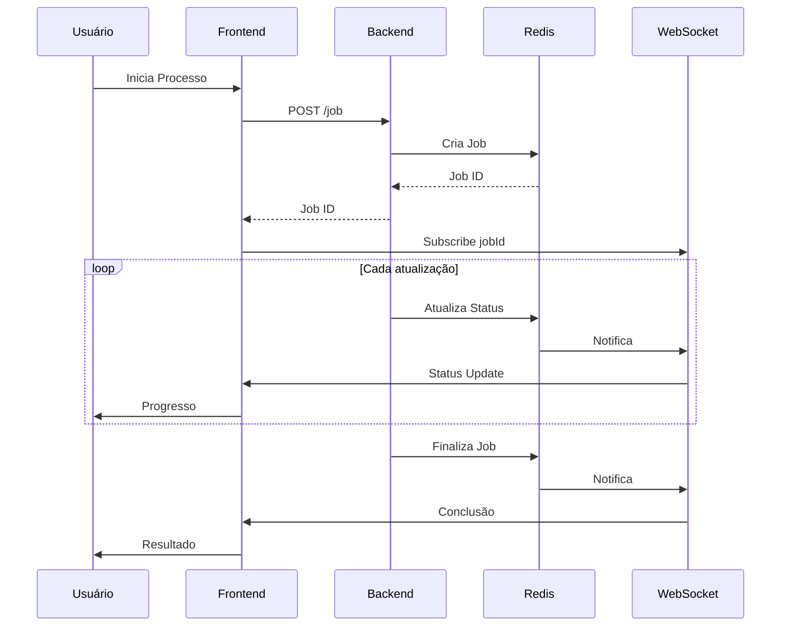

# Sistema de Operação do Propos4l

## Fluxo de Operação do Sistema

```mermaid
flowchart TB
    subgraph Client["Cliente"]
        UI["Interface Web"]
        PDF["PDF Upload"]
        Form["Formulário"]
    end

    subgraph Processing["Processamento"]
        direction TB
        OCR["OCR Engine"] --> TextExtract["Extração de Texto"]
        TextExtract --> NLP["Processamento NLP"]
        NLP --> Vector["Vetorização"]
        
        FormValid["Validação"] --> Context["Contexto"]
        Vector --> Search["Busca Semântica"]
        Search --> Context
        Context --> Generation["Geração"]
    end

    subgraph Storage["Armazenamento"]
        DB[(PostgreSQL)]
        VectorDB[(FAISS)]
        Cache[(Redis)]
        S3["Object Storage"]
    end

    subgraph AI["Serviços IA"]
        LLM["Large Language Model"]
        Embedding["Embedding Model"]
    end

    PDF --> OCR
    Form --> FormValid
    Generation --> LLM
    NLP --> Embedding
    Embedding --> Vector

    DB --> Search
    VectorDB --> Search
    Generation --> Cache
    PDF --> S3
end

## Fluxo de Processamento de PDF

```mermaid
sequenceDiagram
    participant U as Usuário
    participant FE as Frontend
    participant BE as Backend
    participant OCR as OCR Engine
    participant NLP as NLP Service
    participant DB as Database
    participant VS as Vector Store

    U->>FE: Upload PDF
    FE->>BE: POST /upload
    BE->>OCR: Processar PDF
    OCR->>BE: Texto Extraído
    BE->>NLP: Análise de Texto
    NLP->>BE: Blocos Identificados
    BE->>DB: Salvar Metadados
    BE->>VS: Armazenar Vetores
    BE->>FE: Status Sucesso
    FE->>U: Confirmação
```

## Fluxo de Geração de Proposta



## Monitoramento em Tempo Real


